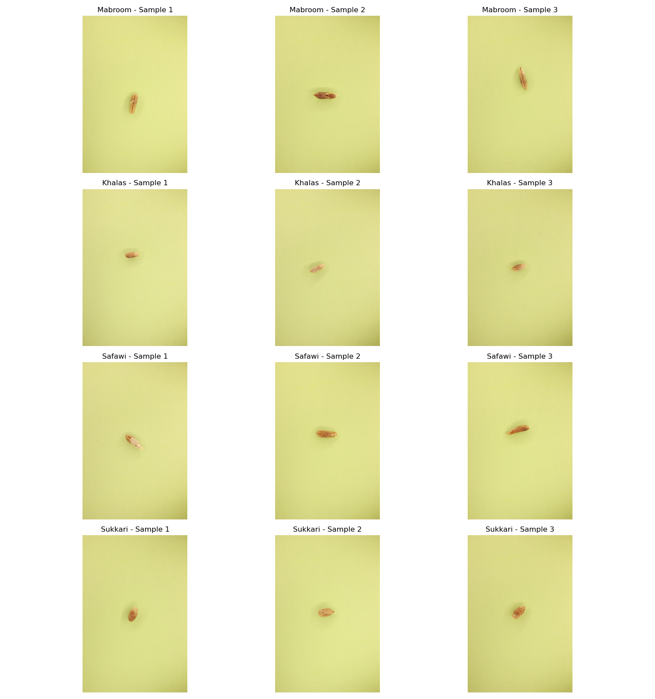
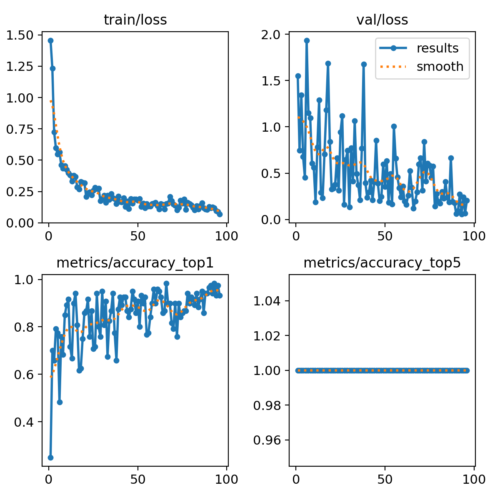
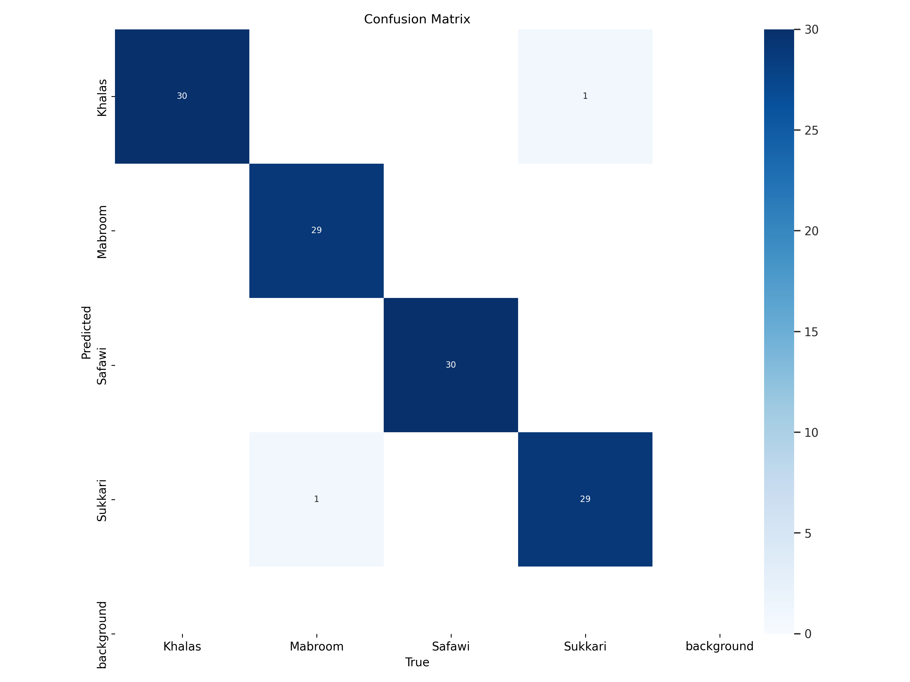

# Seed2Date: Date Seed Classification

A deep learning project for classifying different varieties of date fruits based on images of their seeds.

<div style="text-align: center;">
    
</div>

## Project Overview

Seed2Date uses computer vision and deep learning to accurately identify four varieties of date seeds: Khalas, Mabroom, Safawi, and Sukkari. By analyzing seed morphology, the model can distinguish between varieties with high accuracy, potentially assisting in agricultural quality control, research, and varietal authentication.

## Dataset

The dataset consists of high-resolution images of date seeds (5184×3456 pixels), organized as follows:

```
Date_Seeds/
├── train/
│   ├── Khalas/    (240 images)
│   ├── Mabroom/   (240 images)
│   ├── Safawi/    (240 images)
│   └── Sukkari/   (240 images)
├── val/
│   ├── Khalas/    (30 images)
│   ├── Mabroom/   (30 images)
│   ├── Safawi/    (30 images)
│   └── Sukkari/   (30 images)
└── test/
    ├── Khalas/    (30 images)
    ├── Mabroom/   (30 images)
    ├── Safawi/    (30 images)
    └── Sukkari/   (30 images)
```

### Morphometric Analysis

A comprehensive analysis of all 960 seed images in the training set revealed distinctive morphological differences between varieties:

| Variety | Aspect Ratio (Mean) | Aspect Ratio (Median) | Width (Mean px) | Height (Mean px) | Color Profile (RGB) |
|---------|---------------------|----------------------|----------------|-----------------|---------------------|
| Khalas  | 0.63 ± 0.49         | 0.42                 | 1180 ± 704     | 2172 ± 671      | [219, 219, 141]     |
| Mabroom | 1.06 ± 0.64         | 0.84                 | 1765 ± 611     | 2057 ± 935      | [222, 221, 140]     |
| Safawi  | 1.10 ± 0.64         | 0.91                 | 1934 ± 609     | 2165 ± 907      | [222, 221, 140]     |
| Sukkari | 1.19 ± 0.50         | 1.12                 | 2423 ± 694     | 2178 ± 494      | [219, 219, 136]     |

Key observations from the morphometric analysis:

1. **Aspect Ratio Differentiation**: Khalas seeds are distinctly more elongated (median aspect ratio 0.42) compared to Sukkari seeds which are wider (median aspect ratio 1.12)

2. **Width Variation**: Sukkari seeds are significantly wider (mean 2423px) than Khalas seeds (mean 1180px)

3. **Color Consistency**: All varieties show similar color profiles, indicating that shape characteristics are more discriminative than color

4. **High Intra-class Variability**: The high standard deviations in aspect ratio indicate considerable variation within each variety, which makes classification challenging

## Model Architecture

Seed2Date uses YOLOv11 classification architecture (yolo11n-cls) with the following key components:

- **Backbone**: Optimized for seed feature extraction
- **Classification Head**: Specialized for the four date varieties
- **Input Resolution**: 640×640 pixels
- **Parameters**: 1.5M parameters

## Augmentation Strategy

After extensive experimentation, we identified the optimal augmentation strategy that preserves critical seed characteristics while enhancing model generalization:

```python
# Optimal augmentation configuration
augmentation_params = {
    'hsv_h': 0.015,          # Minimal hue variation
    'hsv_s': 0.6,            # Moderate saturation
    'hsv_v': 0.4,            # Moderate brightness
    'degrees': 15.0,         # Moderate rotation
    'translate': 0.15,       # Small translation
    'scale': 0.25,           # Moderate scaling
    'mosaic': 0.5,           # Partial mosaic
    'auto_augment': "randaugment",  # Additional variety
    'erasing': 0.15,         # Light random erasing
    'flipud': 0.2,
    'fliplr': 0.5,
  
}
```

This configuration was determined through systematic experimentation, with special attention to preserving the aspect ratio characteristics that differentiate seed varieties.

## Training Details

The model was trained in multiple phases with careful hyperparameter tuning:

```python
model.train(
    # Training parameters
    epochs=600,
    batch=64,
    imgsz=640,
    patience=30,
    
    # Optimizer settings
    lr0=0.01,
    lrf=0.01,
    optimizer='AdamW',
    weight_decay=0.0005,
    cos_lr=True,

    # Augmentation settings (as above)
```

### Training Process

- **Training**: 96 epochs with early stopping (patience=30)


## Results

The model achieved excellent performance after optimization:

| Metric | Score |
|--------|-------|
| Training Accuracy | 99.1% |
| Validation Accuracy | 98.3% |
| Test Accuracy | 98.3% |





*Training and validation metrics over epochs*


### Confusion Matrix

The model shows excellent discrimination between all four date seed varieties, with minimal confusion between classes.

<div style="text-align: center;">
    
</div>


## Installation and Usage


### Setup

```bash
# Clone the repository
git clone https://github.com/yourusername/Seed2Date.git
cd Seed2Date

# Install dependencies
pip install -r requirements.txt
```

### Training

```bash
python scripts/train_model.py
```

### Inference

```python
from ultralytics import YOLO

# Load the trained model
model = YOLO('models/Seed2Date-YOLOv11n-best.pt')

# Classify a single image
results = model('path/to/seed_image.jpg')
print(f"Predicted class: {results[0].names[results[0].probs.top1]}")
print(f"Confidence: {results[0].probs.top1conf:.2f}")


```

## Data Exploration

The `results/morphometrics` directory contains comprehensive analysis of all seed images, including:

- Aspect ratio distributions for each variety
- Dimensional measurements for width and height
- Color profile analysis
- Statistical summaries of morphological characteristics

These analyses informed our model design and augmentation strategies, particularly in understanding the importance of preserving aspect ratio information during training.


## Acknowledgments

- [Ultralytics](https://github.com/ultralytics/ultralytics) for the YOLO implementation

