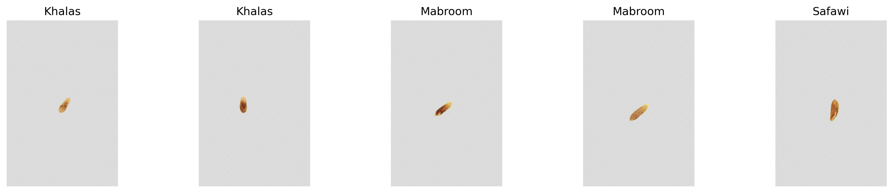

# Seed2Date: Date Seed Classification & Segmentation

A comprehensive deep learning project for analyzing date fruits through their seeds, featuring two complementary approaches:

1. **Classification**: Identifying date varieties from seed images
2. **Segmentation**: Detecting and segmenting date seeds in complex environments

<div style="display: flex; justify-content: space-between; margin-bottom: 20px;">
    
    
</div>

## Project Overview

Seed2Date applies advanced computer vision techniques to accurately identify and analyze four varieties of date seeds: Khalas, Mabroom, Safawi, and Sukkari. The project offers two complementary approaches:

### Classification Approach

Accurately identifies the variety of a date seed from its image using a lightweight YOLOv11 classification model, achieving 98.3% accuracy.

### Segmentation Approach

Precisely detects and segments date seeds in various environments using a specialized pipeline:
1. Generate high-quality masks with SAM (Segment Anything Model)
2. Extract seeds with transparency 
3. Create synthetic training data with realistic variations
4. Train robust segmentation models that generalize to real-world conditions

## Dataset

### Classification Dataset

The classification dataset consists of high-resolution images of date seeds (5184×3456 pixels):

```
Date_Seeds/
├── train/  (240 images per variety)
├── val/    (30 images per variety)
└── test/   (30 images per variety)
```

### Segmentation Dataset

The segmentation approach uses:
1. Original seed photos with SAM-generated masks
2. Extracted transparent seed images 
3. Synthetic dataset (2000+ images) created by placing seeds on diverse backgrounds

```
segmentation/
├── extracted_seeds_transparent_background/
│   ├── images/
│   │   ├── Khalas/
│   │   ├── Mabroom/
│   │   ├── Safawi/
│   │   └── Sukkari/
│   └── labels/
├── backgrounds/  (350+ diverse background images)
└── synthetic/
    ├── train/
    ├── val/
    └── test/
```

## Morphometric Analysis

A comprehensive analysis of seed images revealed distinctive morphological differences between varieties:

| Variety | Aspect Ratio (Mean) | Width (Mean px) | Height (Mean px) | Color Profile (RGB) |
|---------|---------------------|----------------|-----------------|---------------------|
| Khalas  | 0.63 ± 0.49         | 1180 ± 704     | 2172 ± 671      | [219, 219, 141]     |
| Mabroom | 1.06 ± 0.64         | 1765 ± 611     | 2057 ± 935      | [222, 221, 140]     |
| Safawi  | 1.10 ± 0.64         | 1934 ± 609     | 2165 ± 907      | [222, 221, 140]     |
| Sukkari | 1.19 ± 0.50         | 2423 ± 694     | 2178 ± 494      | [219, 219, 136]     |

Key observations: Khalas seeds are distinctly more elongated, while Sukkari seeds are wider. Shape characteristics are more discriminative than color.

## Models

### Classification Model

- **Architecture**: YOLOv11n-cls 
- **Parameters**: 1.5M
- **Input Resolution**: 640×640 pixels
- **Training**: 96 epochs with optimized augmentation

### Segmentation Models

Two YOLOv11n-seg models were trained:
1. **Model 1**: Trained on synthetic data only
2. **Model 2**: Trained on synthetic + real data

## Results

### Classification Performance

| Metric | Score |
|--------|-------|
| Training Accuracy | 99.1% |
| Validation Accuracy | 98.3% |
| Test Accuracy | 98.3% |


### Segmentation Performance

Model performance on synthetic test data:

| Model | Precision | Recall | mAP50 | mAP50-95 |
|-------|-----------|--------|-------|----------|
| Synthetic Only | 0.946 | 0.948 | 0.980 | 0.801 |
| Synthetic + Real | 0.960 | 0.908 | 0.978 | 0.810 |


## Segmentation Pipeline

The segmentation workflow consists of four key steps:

### 1. Seed Segmentation with SAM

First, we use SAM to generate high-quality masks for date seeds from controlled images.


### 2. Extract Seeds with Transparency

Next, we extract the segmented seeds with transparency for synthetic data generation.



### 3. Generate Synthetic Dataset

We place extracted seeds on diverse backgrounds with random variations in position, scale, and rotation.


### 4. Train Segmentation Models

Finally, we train YOLOv11 segmentation models on the synthetic dataset.


### Classification

```bash
# Train classification model
python scripts/train_model.py

# Inference
from ultralytics import YOLO
model = YOLO('models/Seed2Date-YOLOv11n-best.pt')
results = model('path/to/seed_image.jpg')
print(f"Predicted class: {results[0].names[results[0].probs.top1]}")
```


## Project Structure

```
Seed2Date/
├── README.md
├── images/                    # Visualization images for README
├── models/                    # Trained model weights
├── results/                   # Analysis results
│   ├── morphometrics/         # Seed measurement analysis
│   ├── results_explor_data/   # Data exploration results
│   └── train_results/         # Training metrics and visualizations
├── scripts/                   # Classification scripts
│   ├── explore_data.py
│   ├── prepare_data.py
│   ├── seed_measurements.py
│   └── train_model.py
└── segmentation/              # Segmentation pipeline
    ├── README.md              # Detailed segmentation documentation
    ├── generate_seed_masks_sam.py
    ├── extract_transparent_seeds.py
    ├── generate_synthetic_data.py
    └── prepare_data_split.py
```

## Acknowledgments

- [Ultralytics](https://github.com/ultralytics/ultralytics) for the YOLO implementation
- [Segment Anything Model (SAM)](https://github.com/facebookresearch/segment-anything) for high-quality seed segmentation
