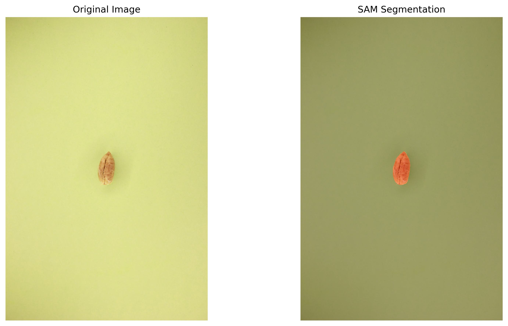

# Date Seed Segmentation Pipeline

## Overview

This project implements an end-to-end pipeline for date seed segmentation with the following goals:
- Generate high-quality segmentation masks for date seeds
- Create a synthetic dataset for robust model training
- Train segmentation models that generalize well to real-world conditions

The pipeline addresses the challenge of limited training data by extracting segmented seeds and placing them on diverse backgrounds to create synthetic training images.

## Pipeline Steps

### 1. Seed Segmentation with SAM ✓

First, we use the Segment Anything Model (SAM) to generate high-quality masks for date seeds from controlled images.

```bash
python generate_seed_masks_sam.py
```



### 2. Extract Seeds with Transparency ✓

Next, we extract the segmented seeds with transparency to prepare them for synthetic data generation.

```bash
python extract_transparent_seeds.py
```

 

### 3. Generate Synthetic Dataset ✓

We place the extracted seeds on diverse backgrounds with random variations in position, scale, and rotation.

```bash
python generate_synthetic_data.py
```


### 4. Train Segmentation Models ✓

Finally, we train YOLOv8 segmentation models on the synthetic dataset and evaluate performance.

```bash
python train_model.py
```

## Training Metrics and Visualizations

During training, YOLOv8 generates comprehensive metrics and visualizations to track model performance:

### Training Progress


### Precision-Recall Curves

<div style="display: flex; flex-wrap: wrap; gap: 10px;">
    
    
</div>

### Confusion Matrix

<div style="display: flex; flex-wrap: wrap; gap: 10px;">
    
    
</div>

### Example Predictions

<div style="display: flex; flex-wrap: wrap; gap: 10px;">
    
    
</div>

## Model Performance

We trained two models with different training data:

### Model 1: Synthetic Data Only (seed2date_segmentation_synthetic.pt)

| Class | Precision | Recall | mAP50 | mAP50-95 |
|-------|-----------|--------|-------|----------|
| All | 0.946 | 0.948 | 0.980 | 0.801 |
| Khalas | 0.904 | 0.938 | 0.968 | 0.769 |
| Mabroom | 0.955 | 0.905 | 0.978 | 0.790 |
| Safawi | 0.962 | 0.967 | 0.985 | 0.830 |
| Sukkari | 0.962 | 0.980 | 0.989 | 0.813 |

### Model 2: Synthetic + Real Data (seed2date_segmentation_combined.pt)

| Class | Precision | Recall | mAP50 | mAP50-95 |
|-------|-----------|--------|-------|----------|
| All | 0.960 | 0.908 | 0.978 | 0.810 |
| Khalas | 0.937 | 0.907 | 0.968 | 0.778 |
| Mabroom | 0.930 | 0.851 | 0.969 | 0.802 |
| Safawi | 0.972 | 0.902 | 0.981 | 0.851 |
| Sukkari | 1.000 | 0.971 | 0.993 | 0.810 |

### Key Findings

- Both models achieved excellent performance (mAP50 > 0.97)
- Model 1 showed higher recall, more consistent across classes
- Model 2 showed higher precision, particularly on Sukkari class (perfect 1.0)
- The synthetic data approach proved highly effective for training

 
